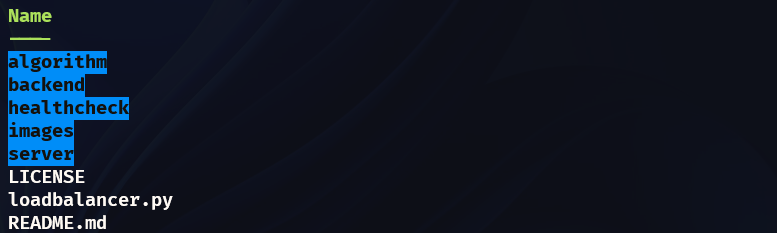

<p align="center">
<em>Developing my own Load Balancer</em>
</p>


---

## About

Following the guidelines of the [Coding Challenges blog](https://codingchallenges.fyi/challenges/challenge-load-balancer), the goal of this project is the development of a **_load balancer_**.

A load balancer sits in front of a group of servers and routes client requests across all of the servers that are capable of fulfilling those requests.

Load balancers can work at different levels of the OSI seven-layer network model. We’re going to focus on a layer seven - application load balancer, which will route HTTP requests from clients to a pool of HTTP servers.


> Give me a star if you find it useful :)

---

## Requirements

[](https://python.org)


---

## Set up

Download the application repository:

```terminal
git clone https://github.com/mariollesta/my-own-loadbalancer.git
```
On the other hand, open your favorite terminal application to be able to execute the corresponding files. You will need to have several tabs to be able to run the balancer, the servers and the client curls.

## How to use

To test the program, from the terminal we will access the repository that we have previously downloaded. This has the following structure:



First step:

Go to the server directory and run three servers, which will be the ones to which the requests will be sent, on three different ports (in case you want to run more or less servers, modify the server_db.json file).

In my case, I will run them on ports 5001, 5002 and 5003, respectively.

```terminal
python .\server.py <PORT>
```

The next step is to run the load balancer. To do this, we go one directory back and run the file loadbalancer.py specifying the port. In case of not specifying a port, it will be executed by default on port 5432.

```terminal
python .\loadbalancer.py <PORT>
```

With the servers and the balancer running, we make several curls to localhost to port 5432 and we see how the requests are distributed according to the Round Robin balancing algorithm, receiving in the client the response from the corresponding server.

In the event that one of the servers goes down, the healthcheck configured in the balancer will log the downtime and bypass that server to send requests. To see a demonstration, we "pull" the server from port 5002: 

If we bring the server back up on port 5002, the healthcheck will notify us and it will be taken into account again for request balancing.

---
